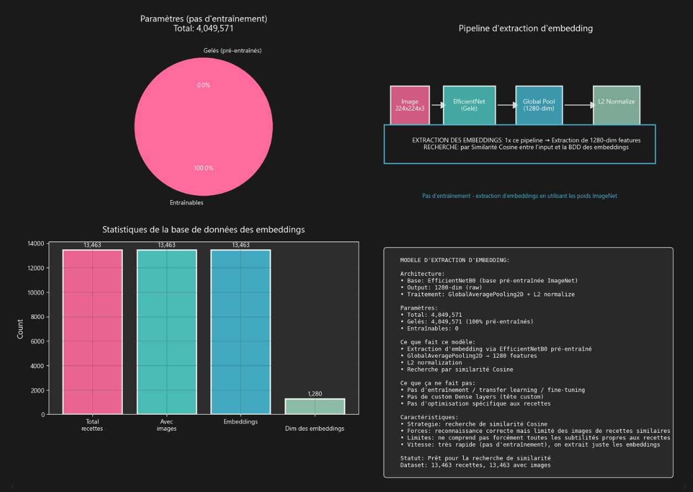
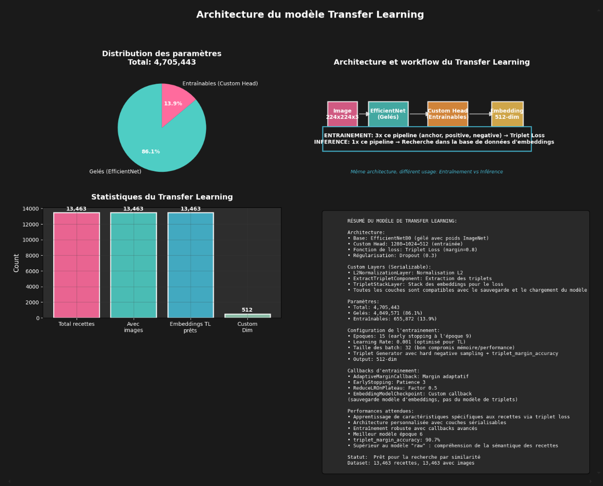
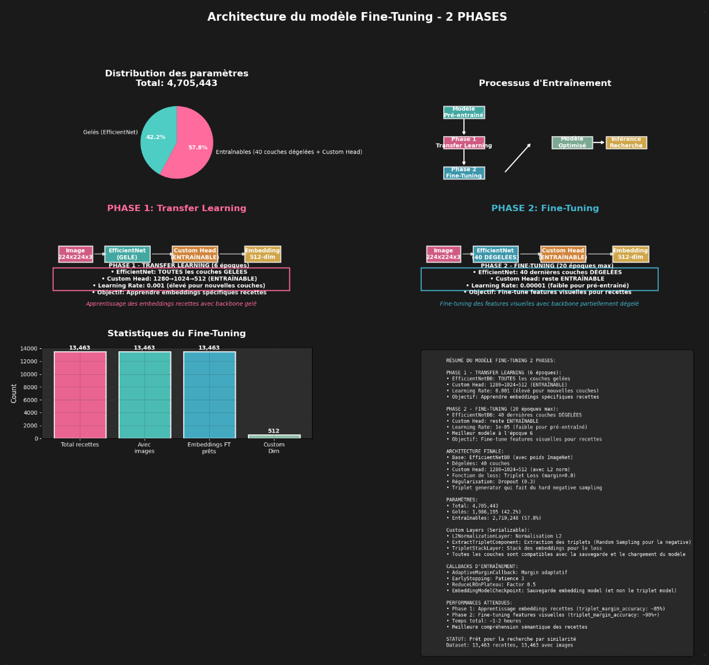

# 🍜 Itadaki - Recipe Image Retrieval System

_"Itadaki" signifie "bon appétit" en japonais_

## 🎓 Projet de certification DEV IA - Alyra

Ce projet constitue le **projet final** de la certification **Développeur Intelligence Artificielle** d'Alyra. Il implémente un système de recherche d'images de recettes utilisant l'apprentissage profond.

**Compétences évaluées (Bloc C5)** :

- **C1** : préparer des données non structurées en les convertissant en données numériques
- **C2** : sélectionner l'algorithme d'apprentissage profond le plus adapté
- **C3** : entraîner un modèle d'apprentissage profond en optimisant une loss function
- **C4** : déployer efficacement un modèle d'apprentissage profond

## 🎯 Vue d'ensemble

Système d'intelligence artificielle qui **trouve des recettes similaires** à partir d'images de nourriture. Il utilise EfficientNetB0 et l'apprentissage profond pour analyser des photos de plats et proposer des recettes correspondantes depuis une base de données de 13,000+ recettes.

## 📚 Évolution du projet - 4 notebooks progressifs

Ce projet documente une **approche itérative** d'amélioration continue, avec 4 notebooks montrant l'évolution des techniques et des performances :

### 1. 🔸 Raw Model (`recipe_image_retrieval_raw.ipynb`)

**Premier essai - EfficientNet gelé**



- **Approche** : utilisation d'EfficientNetB0 pré-entraîné **sans modification**
- **Architecture** : `EfficientNetB0 (frozen) → GlobalAveragePooling → Features (1280D)`
- **Technique** : extraction de features natives sans entraînement supplémentaire
- **Avantages** : rapide à implementer, baseline solide
- **Limites** : pas optimisé pour la similarité de recettes
- **Temps** : ~5 minutes setup

### 2. 🔥 Transfer Learning Simple (`recipe_image_retrieval_tl.ipynb`)

**Deuxième approche - Transfer Learning avec sampling aléatoire**

> _Architecture similaire au TL Hard ci-dessous, mais avec random sampling au lieu de hard negative mining_

- **Approche** : triplet Loss avec EfficientNet gelé + tête personnalisée
- **Architecture** : `EfficientNetB0 (frozen) → Custom Head (1024→512) → L2 Norm`
- **Technique** :
  - **Random sampling** pour les triplets (anchor, positive, negative)
  - **Triplet Loss** avec margin = 0.3
  - Métrique : `triplet_accuracy` (pos_sim > neg_sim)
- **Amélioration** : embeddings optimisés pour la similarité de recettes
- **Limite** : sampling aléatoire pas optimal, métrique peu informative
- **Temps** : ~30-45 minutes

### 3. ⚡ Transfer Learning Amélioré (`recipe_image_retrieval_tl_hard.ipynb`)

**Troisième approche - Negative Sampling**



- **Approche** : transfer Learning avec **hard negative mining**
- **Architecture** : identique au TL simple mais avec sampling intelligent
- **Technique** :
  - **Hard negative sampling** : sélection des négatifs les plus difficiles
  - **Triplet margin accuracy** : mesure si `pos_sim - neg_sim > margin`
  - Amélioration de l'efficacité d'entraînement
- **Avantages** :
  - apprentissage plus efficace avec exemples difficiles
  - métrique plus informative (respect du margin)
  - convergence plus rapide
- **Temps** : ~30-45 minutes (mais plus efficace)

### 4. 🚀 Fine-tuning 2 phases (`recipe_image_retrieval_ft_hard.ipynb`)

**Quatrième approche - Fine-tuning en 2 phases**



- **Approche** : fine-tuning en **2 phases** avec hard negative sampling
- **Architecture** :
  - **Phase 1** : transfer Learning (EfficientNet gelé + Custom Head)
  - **Phase 2** : fine-tuning (40 couches EfficientNet dégelées)
- **Technique** :
  - **Phase 1** : entraînement de la tête personnalisée uniquement
  - **Phase 2** : dégelage intelligent de 40 couches avec learning rates différentiés
  - **Hard negative sampling** pour optimiser l'apprentissage
  - **Triplet margin accuracy** pour un suivi précis
- **Avantages** :
  - adaptation fine du backbone EfficientNet
  - performances maximales
  - entraînement stable et contrôlé
- **Temps** : ~1-2 heures

## 🔬 Comparaison des techniques et performances attendues

| Notebook        | Technique        | Sampling      | Métrique                | Backbone            | Temps  | Performance   |
| --------------- | ---------------- | ------------- | ----------------------- | ------------------- | ------ | ------------- |
| **Raw**         | Features natives | -             | Similarité cosinus      | Gelé                | 5 min  | 🟡 Baseline   |
| **TL Simple**   | Triplet Loss     | Random        | triplet_accuracy        | Gelé                | 45 min | 🟢 Bonne      |
| **TL Hard**     | Triplet Loss     | Hard negative | triplet_margin_accuracy | Gelé                | 45 min | 🟢 Très bonne |
| **FT 2 Phases** | Fine-tuning      | Hard negative | triplet_margin_accuracy | 40 couches dégelées | 1h30   | 🟢 Excellente |

## 🛠️ Installation

### Prérequis

- **Python 3.12+** installé
- **Au moins 8GB de RAM** (recommandé : 16GB+)
- **Espace disque** : ~5GB pour les données et modèles
- **GPU recommandé** pour le fine-tuning

### Installation rapide

```bash
# 1. Cloner le projet
git clone [your-repo-url]
cd itadaki

# 2. Créer l'environnement virtuel
python -m venv itadaki_env

# 3. Activer l'environnement
# Windows:
itadaki_env\Scripts\activate
# Linux/Mac:
source itadaki_env/bin/activate

# 4. Installer les dépendances
pip install --upgrade pip
pip install -r requirements.txt

# 5. Lancer Jupyter
jupyter notebook
```

## 📊 Structure du projet

```
itadaki/
├── 📓 NOTEBOOKS (Evolution Progressive)
│   ├── recipe_image_retrieval_raw.ipynb         # ✅ 1. EfficientNet gelé
│   ├── recipe_image_retrieval_tl.ipynb          # ✅ 2. TL + Random sampling
│   ├── recipe_image_retrieval_tl_hard.ipynb     # ✅ 3. TL + Hard negative sampling
│   └── recipe_image_retrieval_ft_hard.ipynb     # ✅ 4. Fine-tuning 2 phases
├── 📁 MODÈLES & DONNÉES ENTRAÎNÉS
│   ├── raw/                                     # 🔸 Raw Model (EfficientNet gelé)
│   │   ├── recipe_image_retrieval_model_raw.keras        # Modèle embeddings
│   │   ├── recipe_embeddings_database_raw.npy            # Base embeddings (1280D)
│   │   └── recipe_embeddings_database_metadata_raw.pkl   # Metadata pour recherche
│   ├── tl/                                      # 🔥 Transfer Learning
│   │   ├── best_embedding_recipe_image_retrieval_model_tl.keras  # Modèle embeddings
│   │   ├── recipe_embeddings_database_tl.npy                     # Base embeddings (512D)
│   │   └── recipe_embeddings_database_metadata_tl.pkl            # Metadata pour recherche
│   ├── ft/                                      # 🚀 Fine-tuning 2 phases
│   │   ├── best_embedding_recipe_image_retrieval_model_ft.keras  # Modèle embeddings
│   │   ├── recipe_embeddings_database_ft.npy                     # Base embeddings (512D)
│   │   └── recipe_embeddings_database_metadata_ft.pkl            # Metadata pour recherche
│   └── data/                                    # 📊 Dataset principal
│       ├── recipes_with_images_dataframe.pkl   # DataFrame pickle (rechargement facile)
│       └── data.csv                             # Données CSV originales
├── 🖼️ TESTS
│   └── test_recipes/                            # Images de test variées
├── 📊 RAPPORTS
│   └── reports/                                 # Analyses et visualisations
│       └── architecture_images/                 # Images d'architecture des modèles
└── 🔧 CONFIGURATION
    ├── requirements.txt
    └── README.md
```

### 🔍 Détail des dossiers de modèles

Chaque dossier de modèle (`raw/`, `tl/`, `ft/`) contient **3 fichiers essentiels** :

#### 📦 **Modèle Embeddings** (`.keras`)

- **Raw** : `recipe_image_retrieval_model_raw.keras` - EfficientNet gelé (1280D)
- **TL** : `best_embedding_recipe_image_retrieval_model_tl.keras` - TL optimisé (512D)
- **FT** : `best_embedding_recipe_image_retrieval_model_ft.keras` - Fine-tuning 2 phases (512D)

#### 🗄️ **Base de données d'embeddings** (`.npy`)

- **Raw** : `recipe_embeddings_database_raw.npy` - 13,463 embeddings × 1280D
- **TL** : `recipe_embeddings_database_tl.npy` - 13,463 embeddings × 512D
- **FT** : `recipe_embeddings_database_ft.npy` - 13,463 embeddings × 512D

#### 📋 **Metadata** (`.pkl`)

- **Raw** : `recipe_embeddings_database_metadata_raw.pkl` - Index → recette mapping
- **TL** : `recipe_embeddings_database_metadata_tl.pkl` - Index → recette mapping
- **FT** : `recipe_embeddings_database_metadata_ft.pkl` - Index → recette mapping

#### 💾 **Dataset principal** (`data/`)

- **`recipes_with_images_dataframe.pkl`** : DataFrame pickle complet pour rechargement rapide
- **`data.csv`** : Données CSV originales du dataset Kaggle

## 🚀 Guide d'utilisation

### Approche recommandée : progression séquentielle

Pour comprendre l'évolution du projet, il est recommandé de suivre les notebooks dans l'ordre :

#### 1. Commencer par le Raw Model

```bash
jupyter notebook recipe_image_retrieval_raw.ipynb
```

- comprendre la baseline et l'extraction de features
- tester rapidement le système

#### 2. Continuer avec Transfer Learning Simple

```bash
jupyter notebook recipe_image_retrieval_tl.ipynb
```

- découvrir le Triplet Loss et l'optimisation d'embeddings
- voir l'amélioration par rapport au raw model

#### 3. Améliorer avec Hard Negative Sampling

```bash
jupyter notebook recipe_image_retrieval_tl_hard.ipynb
```

- comprendre l'importance du sampling intelligent
- observer l'amélioration de l'efficacité d'entraînement

#### 4. Finaliser avec Fine-tuning 2 phases

```bash
jupyter notebook recipe_image_retrieval_ft_hard.ipynb
```

- découvrir le fine-tuning
- obtenir les meilleures performances

## 🎯 Utilisation du système

### Interface commune à tous les notebooks

```python
# 1. Charger votre image
query_image = "path/to/your/food_image.jpg"

# 2. Rechercher les recettes similaires
results = retrieval_system.search_similar_recipes(query_image, top_k=3)

# 3. Afficher les résultats avec visualisations
retrieval_system.display_results(query_image, results)
```

### Fonctionnalités avancées

```python
# Visualiser l'architecture du modèle
retrieval_system.visualize_model_architecture()

# Analyser les triplets d'entraînement
retrieval_system.show_triplets(num_triplets=3)

# Évaluer les performances
retrieval_system.evaluate_model()
```

## 📥 Dataset

**Food Ingredients and Recipe Dataset with Images** (Kaggle)

🔗 **Lien Kaggle** : https://www.kaggle.com/datasets/pes12017000148/food-ingredients-and-recipe-dataset-with-images

- **13,463 recettes uniques** avec images HD
- **ingrédients détaillés** et instructions complètes
- **images haute qualité** (224x224 minimum)
- **téléchargement automatique** via `kagglehub`
- **taille totale** : ~2GB

## 🏗️ Choix d'architecture : pourquoi EfficientNetB0 ?

### 🎯 Comparaison des architectures backbone

| Architecture                 | Paramètres | Précision ImageNet | Temps inférence | Avantages           | Inconvénients              |
| ---------------------------- | ---------- | ------------------ | --------------- | ------------------- | -------------------------- |
| **EfficientNetB0** ✅        | 5.3M       | 77.1%              | Rapide          | Équilibre optimal   | Relativement récent        |
| **ResNet50**                 | 25.6M      | 76.0%              | Moyen           | Très stable, prouvé | Plus lourd, moins efficace |
| **MobileNetV2**              | 3.5M       | 71.8%              | Très rapide     | Très léger          | Précision plus faible      |
| **Vision Transformer (ViT)** | 86M+       | 81.8%              | Lent            | SOTA précision      | Très gourmand, complexe    |

### 🔍 Justification du choix EfficientNetB0

#### ✅ **Avantages décisifs**

1. **🎯 Équilibre optimal** : EfficientNetB0 offre le meilleur compromis précision/efficacité

   - **précision** : 77.1% sur ImageNet (supérieure à ResNet50 et MobileNet)
   - **efficacité** : 5.3M paramètres seulement (5x moins que ResNet50)
   - **vitesse** : inférence rapide adaptée à la recherche de similarité

2. **🚀 Architecture moderne** : compound scaling et optimisations avancées

   - **compound scaling** : équilibre intelligente depth/width/resolution
   - **inverted bottlenecks** : efficacité computationnelle maximale
   - **squeeze-and-excitation** : attention sur les channels importants

3. **🔧 Facilité d'intégration** : support natif TensorFlow/Keras
   - **pré-entraîné ImageNet** : features visuelles génériques de qualité
   - **transfert learning** : adaptation facile pour les recettes
   - **compatibilité** : stable avec l'écosystème TensorFlow

#### ❌ **Pourquoi pas les autres ?**

##### **ResNet50** - trop lourd pour le contexte

- **25.6M paramètres** : 5x plus lourd qu'EfficientNet
- **précision inférieure** : 76.0% vs 77.1% sur ImageNet
- **architecture plus ancienne** : moins d'optimisations modernes

##### **MobileNetV2** - précision insuffisante

- **précision limitée** : 71.8% sur ImageNet (6% de moins)
- **features moins riches** : impact sur la qualité des embeddings
- **optimisé mobile** : pas nécessaire pour notre use case

##### **Vision Transformers (ViT)** - trop complexe pour débuter

- **🔥 très gourmand** : 86M+ paramètres (16x plus qu'EfficientNet)
- **💻 ressources importantes** : nécessite GPU puissant et beaucoup de RAM
- **⚡ lent à l'inférence** : on voulait un système assez réactif
- **🧠 complexité élevée** : architecture plus difficile à comprendre/déboguer
- **📊 données nécessaires** : performances optimales avec datasets énormes
- **🎓 contexte apprentissage** : moins adapté pour une première approche

### 🎯 Contexte du projet et contraintes

#### **Contraintes techniques**

- **💻 ressources limitées** : développement sur hardware standard et cloud (mais budget limité)
- **⏱️ temps de développement** : formation intensive, itération rapide nécessaire
- **📚 apprentissage progressif** : maîtrise des concepts avant optimisations avancées

#### **Objectifs pédagogiques**

- **🔍 compréhension** : architecture simple à analyser et expliquer
- **🛠️ mise en pratique** : focus sur les techniques d'entraînement (triplet loss) et quelques optimisations (hard negative mining)
- **📈 progression** : de la baseline vers le fine-tuning en 2 phases

### 💡 Évolution future possible

**Pour des performances maximales** (contexte production) :

- **EfficientNet-B2/B4** : compromis précision/efficacité supérieur
- **dataset plus conséquent** : il y a une amélioration directe en rapport avec la quantité de données
- **🤔 utilisation de Food101 ?** : https://www.tensorflow.org/datasets/catalog/food101?hl=fr

#### ✅ **Approche complémentaire : Enrichissement par tags**

**💡 Idée clée** : utiliser Food101 pour **enrichir** le dataset actuel avec des tags alimentaires !

##### **🎯 Stratégie d'enrichissement**

1. **📋 conserver le dataset actuel (ou équivalent plus conséquent)** : toutes les recettes avec métadonnées
2. **🏷️ ajouter des tags Food101** : classifier chaque image avec les 101 catégories
3. **🔄 créer des triplets intelligents** : utiliser les tags pour un sampling plus pertinent

##### **🚀 Avantages de cette approche**

1. **🎯 triplets plus cohérents** :

   - **anchor** : Pizza margherita
   - **positive** : Pizza 4 fromages (même catégorie visuelle)
   - **negative** : Sushi (catégorie visuelle différente)

2. **🧠 apprentissage plus efficace** :

   - triplets visuellement logiques
   - meilleure séparation des embeddings
   - convergence plus rapide

3. **📊 métriques améliorées** :

   - triplet margin accuracy plus élevée
   - similarité intra-classe renforcée
   - séparation inter-classe optimisée

4. **🔄 sampling intelligent** :
   - remplacement du random sampling
   - alternative au hard negative mining
   - approche hybride : tags + difficulté

## 🔧 Architecture technique détaillée

### Configuration par notebook

#### Raw Model

```python
CONFIG_RAW = {
    'IMG_SIZE': 224,
    'BATCH_SIZE': 32,
    'EMBEDDING_DIM': 1280,  # Features natives EfficientNet
}
```

#### Transfer Learning Simple

```python
CONFIG_TL = {
    'IMG_SIZE': 224,
    'BATCH_SIZE': 32,
    'EMBEDDING_DIM': 512,
    'TRIPLET_MARGIN': 0.3,
    'EPOCHS': 10,
    'SAMPLING': 'random'  # Random triplet sampling
}
```

#### Transfer Learning Hard

```python
CONFIG_TL_HARD = {
    'IMG_SIZE': 224,
    'BATCH_SIZE': 32s,
    'EMBEDDING_DIM': 512,
    'TRIPLET_MARGIN': 0.8,
    'EPOCHS': 15,
    'SAMPLING': 'hard_negative'  # Hard negative mining
}
```

#### Fine-tuning 2 phases

```python
CONFIG_FT = {
    'IMG_SIZE': 224,
    'BATCH_SIZE': 32,
    'EMBEDDING_DIM': 512,
    'TRIPLET_MARGIN': 0.8,
    'LAYERS_TO_UNFREEZE': 40,
    'PHASE_1_EPOCHS': 6,  # Transfer Learning
    'PHASE_2_EPOCHS': 20,  # Fine-tuning
    'SAMPLING': 'hard_negative'
}
```

## 📈 Évolution des performances

### Métriques clés

| Notebook    | Métrique principale     | Dimension | Sampling      | Temps train |
| ----------- | ----------------------- | --------- | ------------- | ----------- |
| Raw         | N/A                     | 1280D     | N/A           | N/A         |
| TL Simple   | triplet_accuracy        | 512D      | Random        | 30 min      |
| TL Hard     | triplet_margin_accuracy | 512D      | Hard negative | 35 min      |
| FT 2 phases | triplet_margin_accuracy | 512D      | Hard negative | 90 min      |

### Amélioration progressive

1. **Raw → TL Simple** : embeddings optimisés pour la similarité
2. **TL Simple → TL Hard** : sampling intelligent + métrique plus précise
3. **TL Hard → FT 2 phases** : adaptation fine du backbone pour performances maximales

## 🖼️ Images de test

Le dossier `test_recipes/` contient des images variées pour tester les différents modèles :

```python
# Exemple d'utilisation
test_image = "./test_recipes/1.jpg"
results = retrieval_system.search_similar_recipes(test_image, top_k=5)
```

## 🔍 Concepts clés implémentés

### 1. Triplet Loss

optimisation de la distance entre embeddings pour maximiser la similarité intra-classe et minimiser la similarité inter-classe.

### 2. Hard Negative Mining

sélection intelligente des exemples négatifs les plus difficiles pour améliorer l'efficacité d'entraînement.

### 3. Fine-tuning 2 phases

approche progressive : d'abord entraîner la tête personnalisée, puis adapter le backbone pré-entraîné.

### 4. Triplet Margin Accuracy

métrique avancée qui mesure si la différence `pos_similarity - neg_similarity > margin`, plus informative que la Triplet Accuracy.

## 🎯 Résultats et apprentissages

### Principales découvertes

1. **Raw model** : baseline solide mais non optimisée
2. **Random Sampling** : efficace mais sous-optimal
3. **Hard Negative Mining** : amélioration significative de l'efficacité
4. **Fine-tuning 2 phases** : performances maximales avec contrôle total

### Recommandations

- **pour tests rapides** : utiliser le Raw Model
- **pour production** : Transfer Learning Hard est le meilleur compromis
- **pour recherche avancée** : Fine-tuning 2 phases pour performances maximales

## 📚 Technologies utilisées

- **TensorFlow/Keras** : framework d'apprentissage profond
- **EfficientNetB0** : architecture de backbone
- **OpenCV** : traitement d'images
- **Matplotlib/Seaborn** : visualisations
- **NumPy/Pandas** : manipulation de données
- **Kagglehub** : téléchargement de dataset

## 🎓 Conclusions

Ce projet démontre une approche méthodique d'amélioration continue en intelligence artificielle, depuis une baseline simple jusqu'à des techniques avancées de fine-tuning. Chaque notebook apporte des améliorations progressives et documente les apprentissages obtenus.

La progression **Raw → TL Simple → TL Hard → FT 2 phases** illustre parfaitement comment optimiser graduellement un système d'apprentissage profond pour obtenir des performances maximales.

---

**Projet réalisé dans le cadre de la certification pour la formation de Développeur IA - Alyra**
